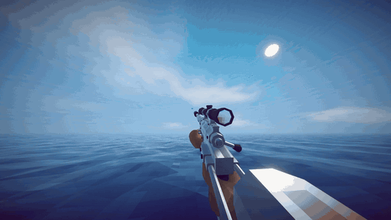
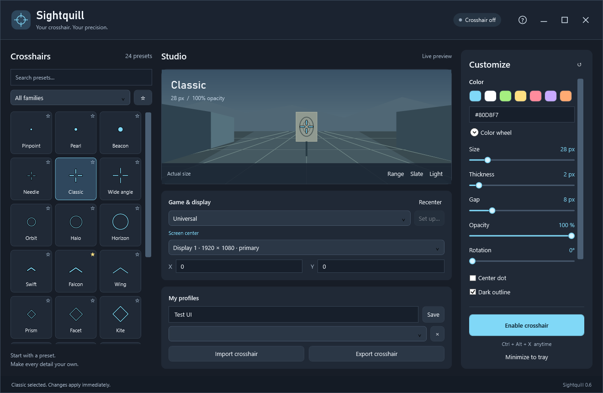
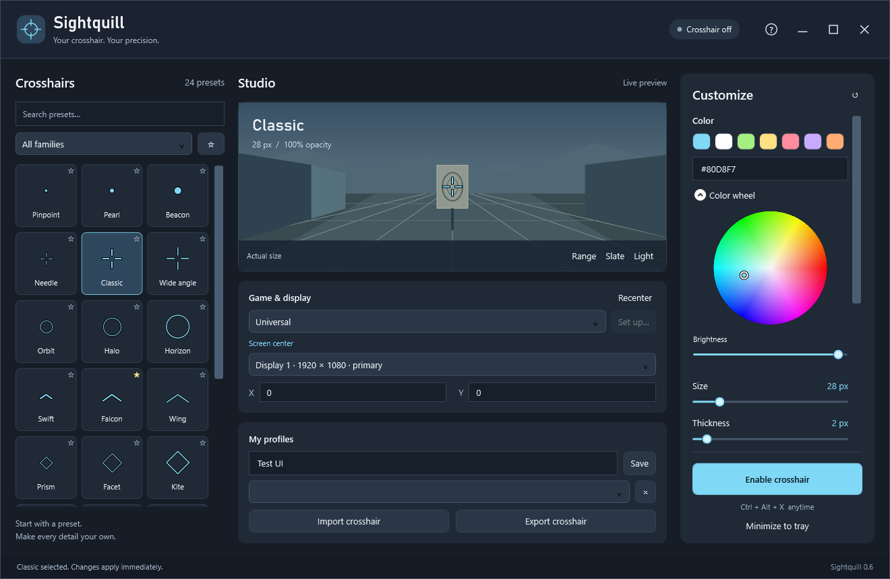
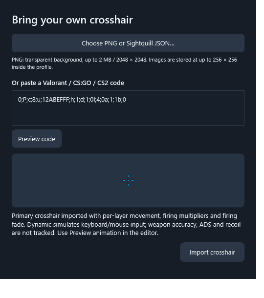

<h1> Sightquill</h1>

## A customizable crosshair for How to Fish

**Give How to Fish a crosshair that fits your play style.** Sightquill is a free, open-source Windows app with adjustable crosshairs and an optional companion that follows the game's weapon aim. Also works as a universal screen-centered overlay for other games.

**[Download for Windows](https://github.com/snitnil-dcflw/Sightquill/releases/latest)** · **[How to Fish setup guide](docs/how-to-fish.md)** · **[Report a problem](https://github.com/snitnil-dcflw/Sightquill/issues)**

[](https://github.com/snitnil-dcflw/Sightquill/releases/download/v0.6.1/Sightquill-How-to-Fish-weapon-inspections.mp4)

**[Watch or download the 1080p video](https://github.com/snitnil-dcflw/Sightquill/releases/download/v0.6.1/Sightquill-How-to-Fish-weapon-inspections.mp4)** — 19 seconds of weapon inspections from gameplay recorded with OBS. Silent edit; the animated preview is reduced in size. Weapons, skins and inspection animations belong to How to Fish; Sightquill provides the crosshair overlay.

### Made for your How to Fish setup

- **Follow weapon aim:** the optional companion positions the crosshair using the weapon's nominal aim direction as it moves.
- **Choose your look:** 24 presets, small dots, rings and cross shapes; adjust size, color, opacity and outlines.
- **Bring your crosshair:** import Valorant Primary codes, CS:GO / CS2 codes, transparent PNGs or Sightquill JSON profiles.
- **Toggle whenever you want:** Ctrl+Alt+X enables or hides the overlay. After companion setup, you can start Sightquill before or after the game.
- **Tune it for your screen:** fixed physical pixels or resolution scaling, with 1080p and 4K rendering tests.

No account, subscription or telemetry. Sightquill draws the crosshair; it does not aim for you or automate shots. Weapon tracking does not predict random spread or bullet drop. The gameplay footage shows the overlay, not a guarantee of where every shot lands.

## Install

Download **Sightquill-Setup-0.6.1-win-x64.exe** from [Releases](https://github.com/snitnil-dcflw/Sightquill/releases/latest). Run it, choose an installation folder and optionally create a desktop shortcut. Installation is per user and does not require administrator privileges. The .NET runtime is included.

A portable ZIP is also available: extract the complete archive and launch Sightquill.exe. SHA-256 checksums accompany each release. This release is not code-signed; Windows may show an unknown-publisher or SmartScreen prompt.

### Set up your How to Fish crosshair

1. Install Sightquill and choose **How to Fish** under **Game & display**.
2. Open **Set up**, select your Steam game folder, and install the companion with the game closed.
3. Launch How to Fish, choose a crosshair, and enable it with **Ctrl+Alt+X**.
4. Return to gameplay. The marker hides while you are in menus or the game is in the background.

First-time setup installs a local BepInEx companion. After that, either launch order works. Use windowed or borderless fullscreen. See the [complete How to Fish guide](docs/how-to-fish.md) for setup and removal.

## Screenshots

The studio brings the preset library, live preview and crosshair controls together.



<details>
<summary>Color wheel and crosshair imports</summary>

Choose a custom color with the wheel and brightness control.



Import transparent PNGs, Sightquill JSON profiles, or Valorant / Counter-Strike codes, and preview the result before adding it.



</details>

## Universal mode and crosshair editing

1. Choose a preset or import a transparent PNG, Sightquill JSON, Valorant Primary code, or CS:GO / CS2 share code.
2. Adjust color, size, opacity and placement. Save named profiles to keep them.
3. Select Universal for a display-centered overlay. Use windowed or borderless fullscreen; exclusive fullscreen is not guaranteed.
4. Enable the crosshair, or press **Ctrl+Alt+X**. It always starts disabled.

Minimizing to the tray keeps the application running. Launching Sightquill again restores the editor. Closing the application also closes the overlay. The overlay passes clicks through to the game.

### Crosshair imports and animation

PNG input: transparent background, up to 2 MB / 2048 x 2048 pixels, embedded at up to 256 x 256. JSON preserves settings and embedded images. PNG export captures the resting appearance; game share-code export is not supported.

Valorant imports preserve Primary inner/outer lines, dot, outlines, layer movement/firing switches, multipliers and simulated firing fade. Animated codes enable Dynamic automatically. Use Preview animation to inspect movement, firing and recovery. Reimport codes imported before 0.6 to recover previously discarded animation settings.

Dynamic uses ZQSD/WASD and the left mouse button in How to Fish, Valorant or CS:GO / CS2. It simulates input; it does not measure weapon accuracy, recoil, velocity or ADS. Game chat/menu input can also trigger animation in Universal mode. Native and PNG crosshairs use generic animation. JSON sharing preserves animation parameters; recipients need 0.6 or later for Valorant layer rules.

Scale with resolution uses a 1080p reference and is independent of Windows UI scaling. Disable it for fixed physical pixel dimensions. Imported crosshairs default to fixed pixels.

### Optional How to Fish tracking

Official release packages include the companion under Integrations/HowToFish. Choose How to Fish, open Set up, close the game, and install the companion. The official BepInEx loader is downloaded and hash-verified only when requested. No game assemblies are distributed. See [the integration guide](docs/how-to-fish.md).

The companion follows the nominal aim direction, not random spread or bullet drop. It hides stale telemetry and menus. Other games use the external overlay. This project is not affiliated with the game publishers; compatibility with game updates and anti-cheat systems is not guaranteed.

## Data and uninstall

Preferences and profiles: `%LOCALAPPDATA%\Sightquill\settings.json`. Crash log: `%LOCALAPPDATA%\Sightquill\error.log`. There is no account, telemetry or keystroke history.

Uninstall Sightquill through Windows Installed apps. Preferences are retained. Remove the optional game companion through Set up **before** uninstalling Sightquill; application uninstall does not alter game folders.

## Build from source

Windows x64, PowerShell, [.NET 10 SDK](https://dotnet.microsoft.com/download/dotnet/10.0).

```powershell
./build.ps1
# Close any running Sightquill before the interactive desktop tests.
./test.ps1
./publish.ps1
./build-installer.ps1 -Compiler 'C:/Program Files/Inno Setup 7/ISCC.exe'
```

The default publish builds Universal functionality without requiring a game installation. The installer compiler is [Inno Setup](https://jrsoftware.org/). Outputs are under artifacts; binaries are distributed through Releases, not committed to Git.

To include the optional companion, extract the official BepInEx 5.4.23.5 x64 SDK into `.tools/bepinex` and supply your own installed Unity Mono game:

```powershell
./publish.ps1 -GameDirectory 'X:/SteamLibrary/steamapps/common/How to Fish/How to Fish'
./build-installer.ps1
```

The build uses game libraries only as non-copied references. Do not upload game DLLs, downloaded SDKs, personal profiles or signing keys. CI builds/tests the application and publishes a Universal portable artifact; official companion-inclusive release packages are built with local game references.

## Contributing and license

Bug reports should include the app version, display resolution/scaling, reproduction steps and crosshair code where applicable. See [CONTRIBUTING](CONTRIBUTING.md).

Sightquill is licensed under [MIT](LICENSE). See [third-party notices](THIRD-PARTY-NOTICES.md) for dependencies and trademarks.
